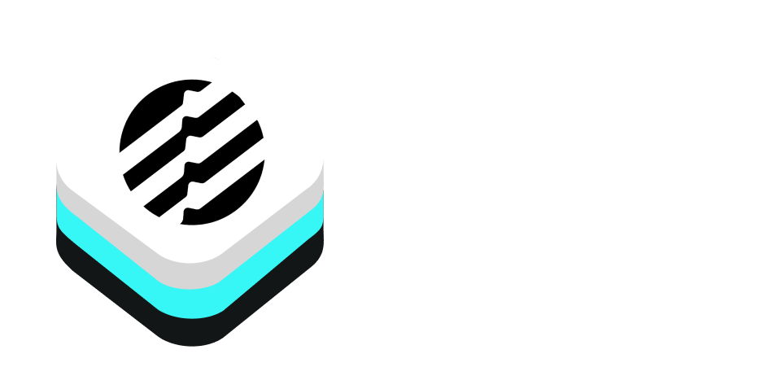

[](https://img.shields.io/badge/Swift-5.5_5.6_5.7-Orange?style=flat-square)
[](https://img.shields.io/badge/Platforms-macOS_iOS_tvOS_watchOS-green?style=flat-square)
[](https://img.shields.io/badge/Swift_Package_Manager-compatible-orange?style=flat-square)
[](https://github.com/OpenDive/AptosKit/actions/workflows/swift.yml)

AptosKit is a community-maintained SDK for the Aptos Blockchain environment and REST API.

- [Features](#features)
- [ToDo](#todo)
- [Requirements](#requirements)
- [Installation](#installation)
  - [Swift Package Manager](#swift-package-manager)
    - [SPM Through Xcode Project](#spm-through-xcode-project)
    - [SPM Through Xcode Package](#spm-through-xcode-package)
- [Using AptosKit](#using-aptoskit)
- [Development and Testing](#development-and-testing)
- [Next Steps](#next-steps)
- [Credits](#credits)
- [License](#license)

## Features

- [x] Generate new wallets.
- [x] Create new accounts using the ED25519 Key Standard.
- [x] Simulate and submit transaction.
- [x] Create new collections.
- [x] Create new tokens.
- [x] Check account information (Token and APT balances, submitted contracts, etc).
- [x] Import previously used wallets using BIP-39 and BIP-32 Mnemonic seeds or an ED25519 private key.
- [x] Compatibility with main, dev, and test networks.
- [x] Comprehensive Unit and Integration Test coverage.
- [x] Swift Concurrency Support back to iOS 13, macOS 10.15, tvOS 13, and watchOS 6.
- [x] Complete documentation of AptosKit.
- [x] Implement Token REST Client.

## ToDo

- [ ] Token REST Client Example.
- [ ] Implement enum object to switch between development, test, and main networks.

## Requirements

| Platform | Minimum Swift Version | Installation | Status |
| --- | --- | --- | --- |
| iOS 13.0+ / macOS 10.15+ / tvOS 13.0+ / watchOS 6.0+ | 5.5 | [Swift Package Manager](#swift-package-manager) | Fully Tested |
| VisionOS 1.0 | 5.8 | [Swift Package Manager](#swift-package-manager) | Untested |

## Installation

### Swift Package Manager

The [Swift Package Manager](https://swift.org/package-manager/) allows for developers to easily integrate packages into their Xcode projects and packages; and is also fully integrated into the `swift` compiler.

#### SPM Through XCode Project

* File > Swift Packages > Add Package Dependency
* Add `https://github.com/opendive/AptosKit.git`
* Select "Up to next Major" with "1.1"

#### SPM Through Xcode Package

Once you have your Swift package set up, add the Git link within the `dependencies` value of your `Package.swift` file.

```swift
dependencies: [
    .package(url: "https://github.com/opendive/AptosKit.git", .upToNextMajor(from: "1.1"))
]
```

## Using AptosKit

AptosKit is designed to be fully flexible for any project environment, and can easily be integrated into any projects using Swift 5.5 or later. The main method of utilizing AptosKit is to initialize a `Wallet` object using a Mnemonic, and a `RestClient` object:

```swift
import AptosKit

do {
    let mnemo = Mnemonic(wordcount: 12, wordlist: Wordlists.english)
    let wallet = try Wallet(mnemonic: mnemo)
    let restClient = try await RestClient(baseUrl: "https://fullnode.devnet.aptoslabs.com/v1")
} catch {
    print("ERROR - \(error)")
}
```

From there, it's as easy as calling one of the provided function members. The code below demonstrates how to airdrop 1 (one) APT token to the previously generated account:

```swift
    // ...
    let faucetClient = FaucetClient(baseUrl: "https://faucet.devnet.aptoslabs.com", restClient: restClient)
    try await faucetClient.fundAccount(wallet.account.address().description, 100_000_000)
    // ...
```

## Development And Testing

We welcome anyone to contribute to the project through posting issues, if they encounter any bugs / glitches while using AptosKit; and as well with creating pull issues that add any additional features to AptosKit.

## Next Steps

* We will also focus on implementing a MultiED25519Authenticator for use with authenticating more than one ED25519 transaction at a time in a single call.

## Credits

I would like to thank the [Aptos Foundation](https://aptosfoundation.org) for providing both the REST API and the blockchain implementation. Without them, this project would cease to be.

## License

AptosKit is released under the MIT license, and any use of Aptos's REST endpoint will be under the [Apache 2.0 License](https://www.apache.org/licenses/LICENSE-2.0.html) set by them.
